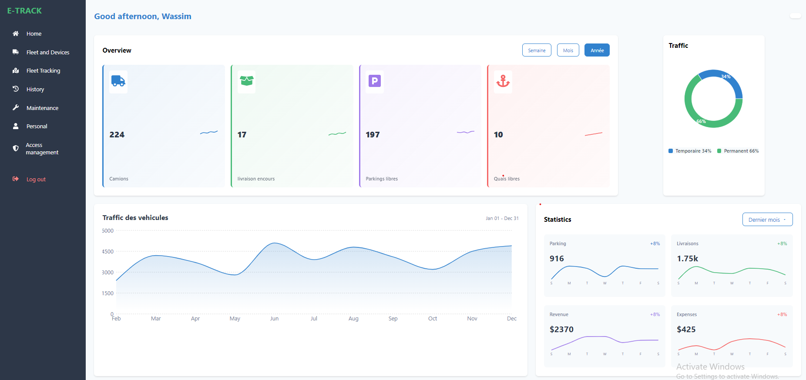
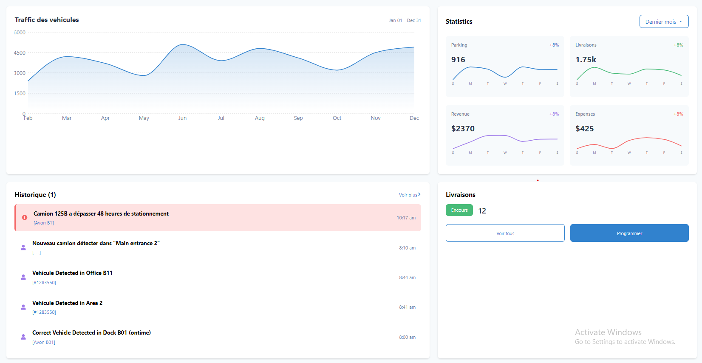

# E-Track Interface


## Features
- **Sidebar**: Navigation menu for seamless browsing.
- **Header**: Displays page title and global actions.
- **Overview**: Provides key statistics at a glance.
- **TrafficChart**: Visualizes traffic data with charts.
- **History**: Logs historical events.
- **Statistics**: Displays detailed data and metrics.
- **Deliveries**: Tracks delivery statuses.


## Project Structure

```bash
/src
├── App.jsx                 # Main application component
├── main.jsx                # Application entry point
├── index.css               # Global styles
├── components              # Contains all reusable components
│   ├── Sidebar
│   │   ├── Sidebar.jsx
│   │   └── Sidebar.module.css
│   ├── Header
│   │   ├── Header.jsx
│   │   └── Header.module.css
│   ├── Overview
│   │   ├── Overview.jsx
│   │   └── Overview.module.css
│   ├── TrafficChart
│   │   ├── TrafficChart.jsx
│   │   └── TrafficChart.module.css
│   ├── History
│   │   ├── History.jsx
│   │   └── History.module.css
│   ├── Statistics
│   │   ├── Statistics.jsx
│   │   └── Statistics.module.css
│   └── Deliveries
│       ├── Deliveries.jsx
│       └── Deliveries.module.css

```
## Screenshots

###  **Dashboard Overview**




## Installation

1. **Clone repository**
   ```bash
   git clone https://github.com/your-username/e-track-dashboard.git
   cd e-track-dashboard
   ```
2. **Install dependencies**
   ```bash
   npm install
   ```
3. **Run development server**
   ```bash
   npm run dev
   ```
## Technologies Used
- **React**: Frontend framework.
- **Vite**: Development and build tool.
- **Modular CSS**: Scoped styling for each component.

## Contribution
1. **Fork the repository**
2. **Create a branch**
    ```bash
    git checkout -b feature/your-feature
    ```
3. **Commit changes**
    ```bash
    git commit -m "Add your feature"
    ```
4. **Push the branch**
    ```bash
    git push origin feature/your-feature
    ```
5. **Create a pull request on GitHub.**


